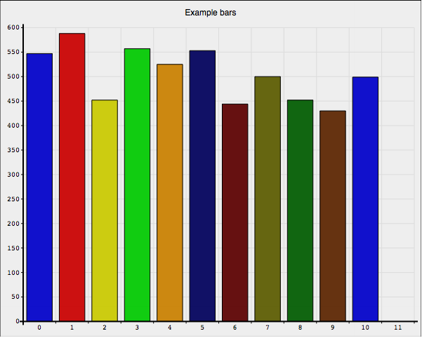
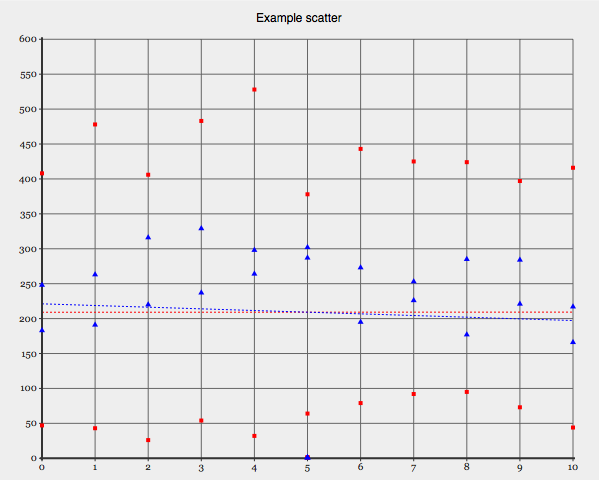

# simple-stats
A simple system to log events in your PHP app

# Installation

You need only to require this package in your project ```composer require jlaso/simple-stats```

# Configuration (optional)

In order to let know the library where it can put it's database file and other things related with setup you can copy the distribution file config-stats-base.yml.dist in the root
of your project with the config-stats-base.yml

This file contains:

```
database:
    driver: pdo_sqlite
    path: "%project_dir%/app/cache/simple_stats.sqlite"
    charset: UTF8    

models:
    - clicks
    - ips
    - logins

```

The database key configures how the sqlite will work, and the models key informs SimpleStats about the events we want to register.
Any change on any of these keys requires remove the sqlite database file in order that SimpleStats recreates new one.

For the moment no migration process is allowed.

## Info

That library uses svg files in order to show the results of the statistics.

# Commands

In order to check the examples I provided a couple of commands that you can start from terminal

### Create demo data

Create thousand of records in every event table with invented data.

```src/console database:create-and-seed```

### Create a graph svg file with the data

```
src/console graph:create --graph=scatter --event="clicks,ips,logins" --title="Events by day" 
open temp.svg.html
```

As you can see you can just pass one event table or several separated by commas.
The output default file is temp.svg.html.

## Graphs provided

As I told you the system uses a third party SVG library in order to represent statistical data.

For the moment there are this graph available:

|Graph|Uses|
|Bar|Data ordered in a bar or piles way |
|Scatter|Data with X reference (2d) with one or several dimensions |

# Running the examples

Go to terminal and start PHP listening in the root folder of the project ```php -S localhost:8000```

Now you can go with your favourite browser to (http://localhost:8000/samples/index.html)[http://localhost:8000/samples/index.html]

For the moment there are two examples. You have to see the same data in both, but using different technology. Just to show you
how easy is to use this library.


